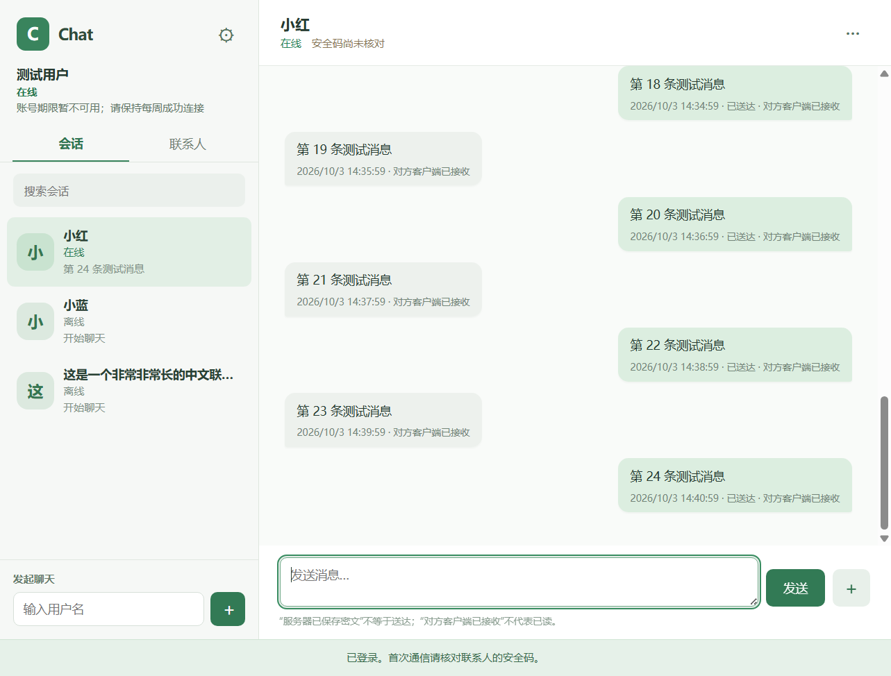

# Chat

Chat 是一个可自行部署的开源一对一通讯项目，提供 Windows 桌面客户端、Android 客户端和 Java 服务器。它适合希望自己管理服务端、了解消息加密边界、参与客户端与服务端开发的人。当前仍是开发验证版，尚未经过独立安全审计；它不是 Signal 官方客户端，也不连接 Signal 服务。

**当前版本：Chat v0.6.1**。发布组合为 Windows 0.6.1、Android 0.5.1（versionCode 17）和服务器 0.2.5。各组件版本也记录在 [release.json](release.json)。

## 可以做什么

- **一对一文字聊天**：双方在同一台 Chat 服务器上注册后，发起聊天请求。首次联系需对方同意；接受前只能发送一条请求消息。文字内容使用官方 libsignal 加密，服务器转发并暂存密文，接收端保存后回传送达 ACK。
- **联系人与会话管理**：查看联系人、会话和在线状态，核对安全码，删除联系人，隐藏会话列表项。隐藏会话不删除本机历史；删除联系人会撤销双方聊天许可，再次联系需要重新同意。
- **位置**：向已接受的联系人发送一次位置，或在应用处于前台且在线时共享实时位置，最长一小时，也可随时停止。位置通过与文字相同的 libsignal 消息通道发送。位置卡片可交给外部地图打开。详见[位置与聊天记录查找](位置与聊天记录查找.md)。
- **语音与视频通话**：已接受的联系人可发起一对一通话，接听、拒绝、静音、挂断，并可缩成可拖动的小窗。通话媒体采用 WebRTC DTLS-SRTP；公网网络可能需要部署 TURN 中继。详见[语音与视频通话](语音与视频通话.md)。
- **本地记录与提醒**：聊天记录在设备上加密保存，可按关键词和日期查找。在线连接收到新消息后有未读提示；Android 应用进程被系统停止后没有消息或来电推送，重新连接后才能领取服务器仍保留的离线密文。

以下是使用测试账号生成的 Windows 界面示意图；画面不代表当前版本的完整功能验收。



## 下载与首次使用

1. 从对应版本的 [GitHub Releases](https://github.com/wobuyaoquminga/chatapp-secure/releases) 获取发布包，并用发布包中的 `SHA256.txt` 核对下载文件。Windows 包名为 `Chat-Client-Windows-x64.zip`，Android 提供正式版 `Chat-Android-arm64-v8a-release.apk` 和旧调试版更新包 `Chat-Android-arm64-v8a-debug.apk`，服务器部署包为 `Chat-Ubuntu-Deploy.tar.gz`。安装前请确认设备处理器架构为 arm64，并按 [Android 安装与更新](android/RELEASE.md)选择原安装渠道。
2. 准备一台自己信任的 Chat 服务器。可在本机运行源码进行试用，或按[Ubuntu 部署指南](deploy/ubuntu/README.md)部署远程服务器。远程访问应使用可信证书的 HTTPS/WSS；`http://127.0.0.1:8082` 仅适用于连接本机开发服务器。Android 连接电脑上的本机服务器时可通过 USB `adb reverse tcp:8082 tcp:8082` 转发，具体步骤见 [Android 说明](android/README.md)。
3. Windows 将 ZIP 完整解压后运行 `Chat-win32-x64/Chat.exe`；Android 安装同渠道、同签名的 APK；正式版与旧调试版的本地数据独立。首次打开时添加服务器地址，随后注册或登录该服务器上的账号。
4. 用户名须为 **2–32 位汉字、小写字母、数字或下划线**；密码至少 8 个字符。输入对方用户名发起联系，对方接受后即可继续聊天。首次交流请通过可信的其他渠道核对双方显示的安全码；对方设备身份变化后应再次核对。

Chat 目前一个账号同时只有一个有效设备身份。忘记密码无法修改或找回账号；清除应用数据、丢失本机密钥或换设备后，可凭原用户名和密码重建设备身份，但无法从服务器恢复原设备上的聊天历史，旧设备身份会失效。客户端本地历史因此需要自行妥善保管。

应用会显示最近一次取得的服务器账号期限，离线临近期限时提示重新连接。到期提示是根据已有服务器记录做的估算，不能代替实际在线连接；应用被系统停止后无法保证提醒。

账号连续 **7 天没有成功认证并连接服务器**，服务端会自动清理该账号、联系人关系及相关服务器密文；只打开应用但未显示在线不算成功连接。服务器在消息首次送达 ACK 满 **7 天**后清理已送达密文，未送达密文随账号清理规则处理。服务端删除密文不删除设备上已保存的本地历史。

## 连接与消息状态

网络恢复后客户端会重试连接。消息界面区分发送中、服务器已接收但等待对方、对方已送达和发送失败；对可重试消息使用原消息的重试入口，客户端保留同一加密信封与消息编号，避免将重试当成新消息发送。服务器接收不等于对方已收到。身份变化时先核对安全码；等待对方接受时查看联系人请求状态。

设置中可检查当前服务器提供的新版本，并下载对应平台和安装渠道的安装包；GitHub 发布页保留为备选入口。服务器管理员需先按 [发布客户端更新](deploy/ubuntu/CLIENT-UPDATES.md)上传安装包。升级前核对版本、安装渠道、签名与兼容性，详见 [Android 安装与更新](android/RELEASE.md)。

## 组件与运行环境

- [server/](server/)：Spring Boot、WebSocket、Flyway。需要 **JDK 17**；开发环境默认使用文件型 H2，生产配置可改用 PostgreSQL。服务器负责账号认证、联系人关系、预密钥、密文队列和通话信令。
- [client/](client/)：Electron Windows x64 客户端。源码运行需要 Windows、Node.js 和 npm；消息加密调用 `@signalapp/libsignal-client`，本机私钥及历史由 Windows 安全存储保护。
- [android/](android/)：原生 Android 客户端，最低 Android 8.0（API 26）。源码构建需要 **JDK 21**、Android SDK Platform 35 和 Build Tools 35.0.0；私钥和本地历史由 Android Keystore 保护。
- [deploy/ubuntu/](deploy/ubuntu/)：Ubuntu 24.04 的单实例部署脚本、HTTPS 模板、TURN 配置与升级指南。

本项目目前没有多设备同步、群聊、附件或自动更新。Windows 便携包无商业代码签名，Android 正式版使用固定发布签名，旧调试版兼容包继续使用原调试签名；安装或更新前应核对来源和签名。Android 覆盖更新必须使用与原安装相同的签名，卸载应用或清除数据会丢失本地密钥与历史。

## 从源码运行

在仓库根目录构建并启动本机服务器（Windows PowerShell）：

```powershell
cd server
.\mvnw.cmd -B -ntp clean verify
java -jar target/chat-server-0.2.5.jar
```

另开一个 PowerShell 窗口启动 Windows 客户端：

```powershell
cd client
npm ci
npm test
npm start
```

首次使用时将桌面客户端服务器地址设为 `http://127.0.0.1:8082`。Android 构建可在 `android/` 下执行 `.\gradlew.bat assembleDebug testDebugUnitTest lintDebug`，APK 输出在 `android/app/build/outputs/apk/debug/`。Linux/macOS 构建命令与完整环境要求见各组件文档；本项目发布的桌面客户端目标平台为 Windows x64。

部署到远程服务器时，先阅读 [Ubuntu 首次部署](deploy/ubuntu/README.md)；升级现有安装时阅读 [升级指南](deploy/ubuntu/UPGRADE.md)，**先升级服务器，再更新客户端**。服务器 0.2.5 首次启动会执行 V8–V10 数据库迁移；若回滚，必须同时恢复升级前的数据库和服务器 JAR。客户端本地加密存储迁移后也不能直接降级。生产访问需要配置可信 HTTPS；通话跨网络连接通常需要 TURN。服务器目前采用单实例架构，不能直接启动多个实例共享状态。

## 安全与隐私边界

文字与位置消息使用官方 libsignal 0.103.0。私钥、解密后的内容和本机聊天历史留在客户端；服务器保存账号、密码校验值、公钥、联系人关系、路由信息和待转发的密文。服务器能看到通信双方、时间等元数据，Chat 不提供匿名通信。安全码需要用户通过可信渠道亲自核对，不能仅凭服务器显示的用户名确认身份。

音视频媒体由 WebRTC 直接传输，或通过 TURN 中继，媒体链路使用 DTLS-SRTP 加密。Chat 服务器转发临时信令，不承载媒体；它能看到通话双方、时间、SDP 和 ICE 网络信息。**当前通话信令未使用 Signal 会话加密，也未绑定安全码**，因此不能把通话称为经过 Signal 身份认证的端到端加密通话。STUN/TURN 及对方设备还可能获知建立连接所需的网络地址。

开发版未经过独立安全审计，也没有保证所有平台、网络与设备组合的可用性。服务器与 Windows/Android 的验证范围见 [VALIDATION.md](VALIDATION.md)；自动测试或模拟界面验证不等于所有功能都已经过新版真机和公网实测。遇到安全问题请按 [SECURITY.md](SECURITY.md) 私下报告，不要在公开 Issue 中放入密码、密钥、令牌、数据库或真实聊天记录。

## 参与项目

欢迎提交可复现的问题、文档改进和聚焦的 Pull Request。请先阅读[贡献指南](CONTRIBUTING.md)，说明触发条件、修改后的行为、迁移影响和实际运行的验证。加密与协议变更需要兼顾 Windows、Android 和服务器的互通。

项目业务源码采用 [AGPL-3.0-only](LICENSE)；第三方依赖及对应源码信息见 [NOTICE.md](NOTICE.md) 和 [vendor/](vendor/)。Chat 不隶属于 Signal。

### 服务器下载更新

Windows 和 Android 可在设置中从当前服务器检查并下载对应安装包。服务器管理员须先发布客户端包；具体操作见 [服务器发布客户端更新](deploy/ubuntu/CLIENT-UPDATES.md)。下载校验通过后由用户确认更新，正式版和调试版不能互相覆盖。
